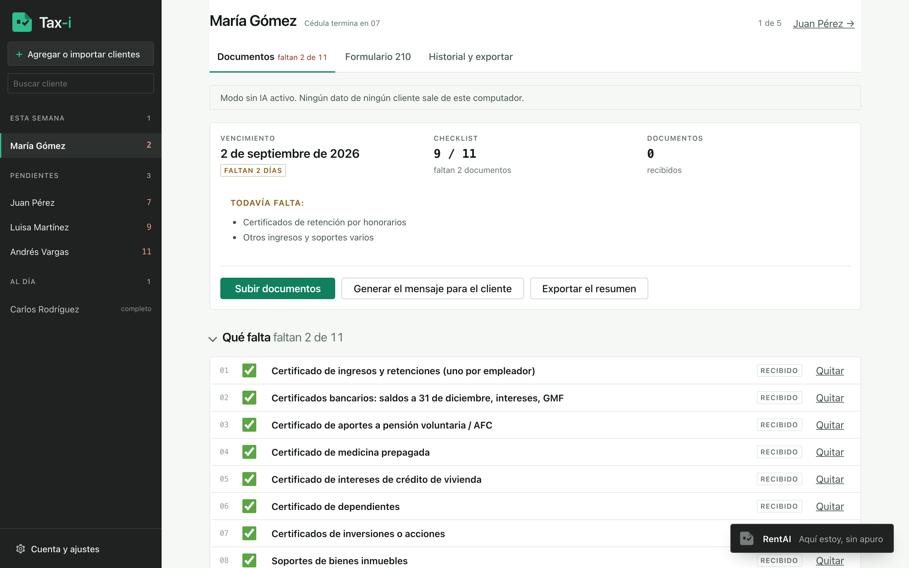
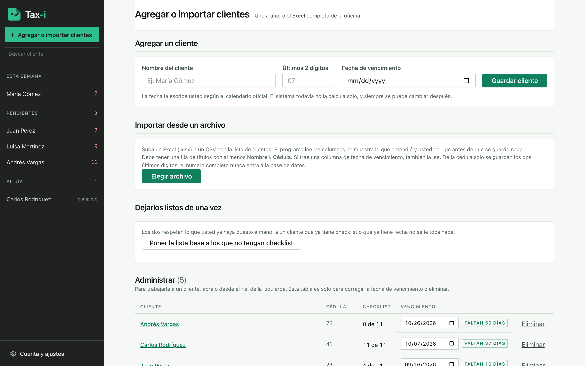
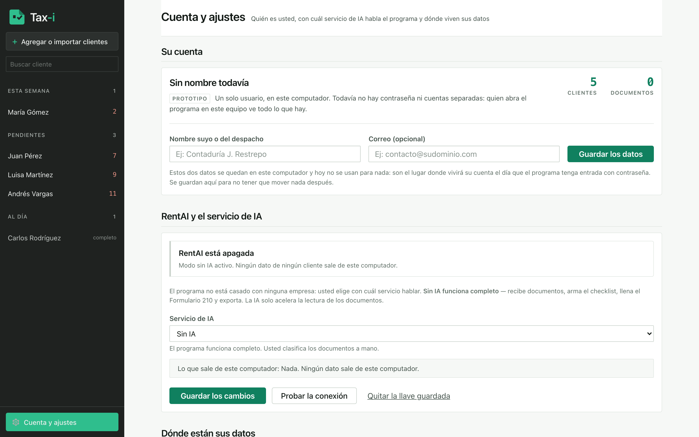

# Tax-i

**El archivador de la temporada de renta.** Recibe los documentos de cada cliente
como lleguen —PDF, fotos del celular, XML de la DIAN, un ZIP entero—, los
identifica, y dice qué le falta a cada quien.

Corre en un solo computador, sin nube, sin cuenta y sin conexión obligatoria.

[](LICENSE)
[](https://www.python.org/downloads/)
[](#por-qué-no-hay-ni-un-archivo-compilado)



---

## El problema

En Colombia, la declaración de renta de una persona natural necesita entre 8 y 12
soportes. Un contador que lleva sesenta clientes recibe esos documentos por
WhatsApp, por correo, en fotos torcidas y en ZIP sin nombre, durante dos meses y
medio, y todo el día se hace la misma pregunta:

> ¿a quién le falta algo y vence pronto?

Hasta ahora eso se contestaba abriendo carpetas una por una. Tax-i lo contesta de
un vistazo: los clientes viven en una lista permanente a la izquierda, ordenados
por urgencia real —lo que falta y la fecha— y no por orden alfabético.

## Qué hace

1. **Llegan los documentos.** Se sueltan como vengan. No hay que renombrar nada.
2. **El programa los identifica.** Reconoce de qué es cada uno y saca los datos.
3. **Se ve qué falta.** Cada cliente tiene su lista, y la lista la manda el contador.
4. **Sale el resumen.** Imprimible, y el mensaje ya redactado para pedirle al cliente.

## Qué NO hace, a propósito

Esto no es letra menuda: es la definición del producto.

Tax-i **no hace impuestos**. No calcula el impuesto a cargo ni el saldo a favor, no
dice qué es deducible, no sugiere cómo declarar y no afirma que un cliente esté o no
obligado a declarar. Las fechas de vencimiento tampoco se calculan: salen del
calendario oficial y se corrigen a mano.

Organiza, muestra lo que dice cada documento **marcándolo como lectura automática**
—con el enlace al original al lado, para verificarlo— y exporta. Las decisiones
tributarias las toma el contador, que es quien responde por ellas.

Un archivador que dijera qué es deducible sería otro programa y otra
responsabilidad.

## Privacidad

Los documentos son información tributaria confidencial de terceros que nunca le
dieron permiso a nadie para moverla.

- **Los archivos nunca salen del computador.** No hay nube, no hay cuenta que
  crear, no hay servidor de nadie más en el medio.
- **De fábrica viene sin IA** (`IA_PROVEEDOR=ninguno`) y así funciona **completo**:
  recibe documentos, arma el checklist, llena el Formulario 210 y exporta. La IA
  acelera la lectura; no habilita el programa.
- Con la IA encendida sale el nombre del cliente, el **texto** de sus documentos, su
  checklist y la conversación. Los archivos nunca se mandan: de un PDF se manda el
  texto que se extrajo aquí. Con `ollama` tampoco sale nada: el modelo corre en el
  mismo equipo.
- **La llave de la API nunca aparece entera**: ni en pantalla, ni en los registros,
  ni en la base de datos, ni en ninguna respuesta. Solo vive en el `.env`.
- Los registros no llevan ni un nombre de cliente ni una cifra.

---

## Cómo se instala

Necesita **Python 3.9 o más nuevo** y nada más. No hay `npm`, no hay compilación y
no hay paso de construcción.

Descargue el ZIP desde la pestaña **[Releases](../../releases)** (o con el botón
verde *Code → Download ZIP*) y descomprímalo donde quiera.

### En Mac

Doble clic en **`iniciar.command`**.

La primera vez macOS va a decir que no puede abrirlo porque viene de un
desarrollador no identificado — es lo normal para cualquier programa sin firmar. Se
arregla una sola vez: **clic derecho sobre el archivo → Abrir → Abrir**.

Desde la terminal es igual:

```sh
./iniciar.sh
```

### En Windows

Doble clic en **`iniciar.bat`**.

Si Windows muestra un aviso azul de SmartScreen, es porque el archivo se bajó de
internet: **Más información → Ejecutar de todas formas**. Si Python no está
instalado, el propio lanzador lo dice y le da el enlace. Al instalarlo hay que
marcar la casilla **"Add Python to PATH"** — es el paso donde todo el mundo se
equivoca, y está explicado con capturas en
[`COMO-PROBAR-EN-WINDOWS.md`](COMO-PROBAR-EN-WINDOWS.md).

### Y ya

Los dos lanzadores hacen lo mismo la primera vez: crean el entorno virtual,
instalan las dependencias y prenden el servidor. Después abra:

```
http://localhost:8000
```

Para apagarlo, `Control + C` en la ventana negra.

---

## Decisiones técnicas

Las que valen la pena contar, con su porqué.

### Por qué no hay ni un archivo compilado

Este es el episodio que decidió media arquitectura.

El programa empezó con **FastAPI**. Funcionaba perfecto en el Mac. Al llevarlo al
computador con Windows 11 donde iba a usarse de verdad, **no arrancaba**.

La causa: FastAPI arrastra `pydantic_core`, que es un archivo compilado (`.pyd`).
El **Control inteligente de aplicaciones** de Windows 11 bloquea binarios sin firmar
por una empresa que Microsoft ya conozca, y las librerías de Python no vienen
firmadas. La única salida habría sido pedirle al contador que apagara una seguridad
de su computador — inaceptable en una máquina que va a guardar documentos
tributarios de terceros.

Así que FastAPI salió. El servidor se reescribió con `http.server`, que ya viene con
Python. Desde entonces la regla es dura: **toda librería tiene que ser de Python
puro**. Si trae `.pyd` o `.so`, no entra. Lo comprueba
[`pruebas/revisar_windows.py`](pruebas/revisar_windows.py).

### Sin framework en el navegador tampoco

HTML, CSS y JavaScript planos. Sin React, sin build, sin `npm`, sin
`node_modules`. Cada pieza de la cadena de construcción es algo más que puede
fallar al instalar en el computador de otra persona, y aquí la instalación la hace
un contador, no un programador.

El costo real de esa decisión es que un error de JavaScript no se nota desde el
servidor: la página carga con código 200 y el botón simplemente no hace nada. Por
eso existe [`pruebas/probar_pantallas.py`](pruebas/probar_pantallas.py), que abre
Chromium de verdad y falla si el JavaScript revienta.

### La IA no está casada con nadie

Cuatro proveedores, elegidos desde la pantalla de Cuenta: `ninguno` (el de fábrica),
`anthropic`, `openai_compatible` (OpenAI, Groq, OpenRouter, Together, DeepSeek, LM
Studio…) y `ollama` (en el propio computador). La capa que traduce de uno a otro
está en [`app/proveedores.py`](app/proveedores.py).

Elegir un servicio es elegir a quién se le confían los textos. Hay capas gratis que
entrenan con lo que uno les manda y donde revisores humanos pueden leerlo. Para
documentos tributarios de terceros, eso pesa más que el precio, y la pantalla de
Cuenta lo dice antes de que uno decida.

### El código maneja los datos; la IA maneja lo desordenado

Nunca se le pide a la IA que calcule, sume, compare cifras ni decida fechas. Si es
XML, se parsea — no se manda a la IA. La IA lee lo que llegó torcido; las cuentas
las hace el código.

### Un solo código para Mac y Windows

No hay dos versiones: hay dos lanzadores. Rutas con `pathlib`, encoding UTF-8
siempre explícito, nombres de archivo sanitizados contra los caracteres que Windows
prohíbe, la basura de macOS ignorada al importar ZIP, y los nombres en `cp437` de
los ZIP hechos en Windows manejados al descomprimir. Son los errores que aparecen
*solo* en Windows, cuando ya no se pueden depurar.

### Las fechas no se calculan: se buscan

La tabla de vencimientos ([`app/vencimientos.py`](app/vencimientos.py)) **viene
vacía a propósito**. Sin tabla, la fecha se escribe a mano, como siempre. Inventar
una fecha de vencimiento tributaria es peor que no tener ninguna.

---

## Pruebas

```sh
.venv/bin/python pruebas/probar_api.py          # el servidor, por HTTP real
.venv/bin/python pruebas/probar_pantallas.py    # el navegador, con Playwright
.venv/bin/python pruebas/revisar_windows.py     # el entorno
.venv/bin/python pruebas/probar_vencimientos.py # la tabla de fechas
```

## Estructura

```
app/         el servidor y la lógica — un archivo por asunto
static/      HTML, CSS y JavaScript planos
pruebas/     lo que comprueba que todo siga funcionando
datos/       documentos, base de datos y papelera. NUNCA se sube a git
.env         la configuración de la IA.        NUNCA se sube a git
```

El brief completo del proyecto está en
[`PROYECTO-ASISTENTE-RENTA.md`](PROYECTO-ASISTENTE-RENTA.md) y las reglas de trabajo
en [`CLAUDE.md`](CLAUDE.md).

## Más capturas

| La lista de clientes | La cuenta y la IA |
|---|---|
|  |  |

Los nombres que salen en las capturas son inventados.

---

## Licencia

**AGPL-3.0.** Ver [`LICENSE`](LICENSE).

En palabras simples: se puede leer, usar, copiar y cambiar, con una condición —
quien lo reparta cambiado, **o lo monte como servicio en internet**, tiene que
publicar su versión bajo esta misma licencia.

Se entrega **tal como está, sin garantía de ninguna clase**. No es un servicio
contratado, no hay soporte y no hay nadie de guardia. Quien lo use responde por el
uso que le dé: revisar cada documento y firmar una declaración son decisiones del
contador, nunca del programa.

## Quién lo hace

**JKUL.** Construido con asistencia de IA (Claude Code) — se ve en el historial de
commits, y los comentarios del código están escritos para que se entiendan sin
formación formal en programación: en español, explicando el porqué de cada decisión
y no solo el qué.
